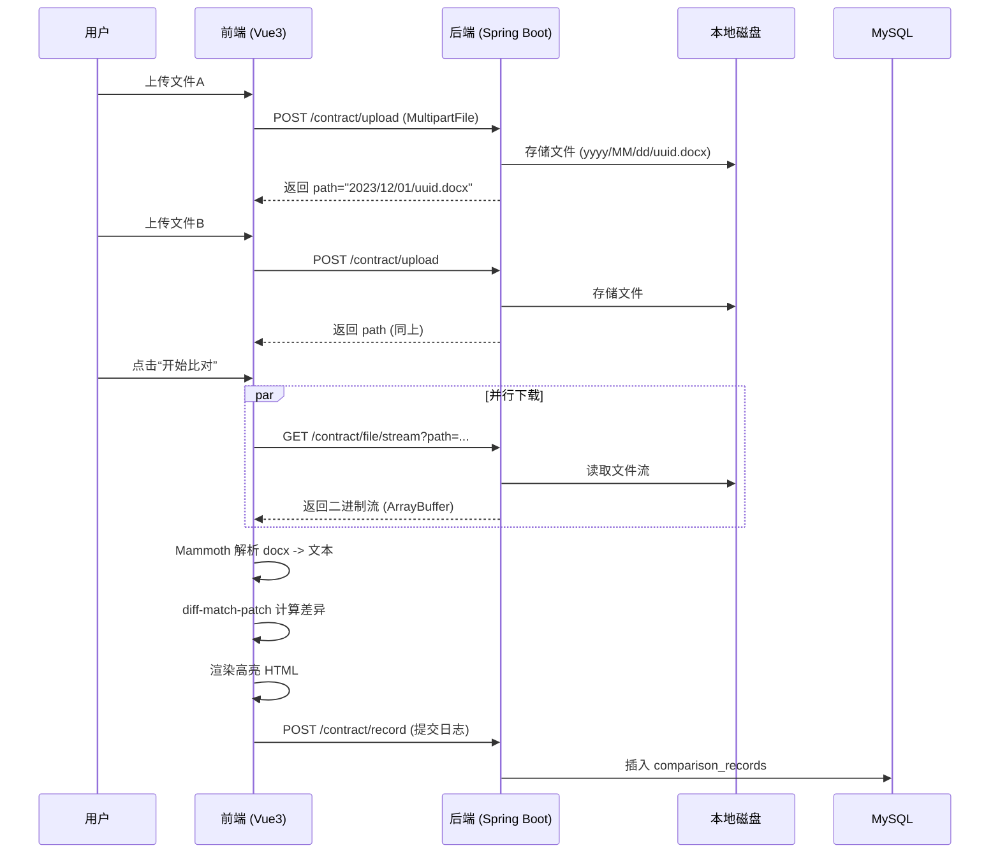

这是一份整合了**产品需求文档 (PRD)** 与 **技术详细设计文档 (Technical Design)** 的完整规范书。该文档已根据您最新的技术约束（Spring Boot 2.7.18, JDK 11, 本地文件存储）进行了全面修订。

-----

# 在线合同智能比对系统 - 产品与技术综合规格说明书

| 文档属性 | 内容 |
| :--- | :--- |
| **项目名称** | 在线合同智能比对系统 (Contract Diff System) |
| **版本号** | V1.0 (Release) |
| **最后更新** | 2025-12-04 |
| **状态** | 已定稿，待开发 |
| **技术核心** | Vue 3 + Spring Boot 2.7 + Local Storage |

-----

# 第一部分：产品需求文档 (PRD)

## 1\. 项目背景与目标

在法务审核与合同管理场景中，人工比对“合同原稿”与“修改稿”耗时且易错。本项目旨在开发一个 Web 端工具，允许用户上传两份 Word 文档，系统自动识别差异并高亮显示，同时保留比对操作记录以备审计。

## 2\. 核心业务流程

1.  **上传**：用户分别上传“基准文件（左）”和“比对文件（右）”。
2.  **处理**：文件存储至服务器本地磁盘，前端获取文件流并解析文本。
3.  **比对**：系统自动计算文本差异。
4.  **展示**：页面左右分栏同步滚动，以不同颜色高亮显示差异。
5.  **归档**：后台自动记录此次比对的操作日志（时间、文件名、存储路径）。

## 3\. 功能需求详细说明

### 3.1 文件上传模块

* **输入限制**：仅支持 `.docx` 格式（Word 2007+），单文件大小不超过 **50MB**。
* **交互设计**：
    * 提供两个独立的上传区域（左侧：原件，右侧：目标件）。
    * 支持拖拽上传和点击选择。
    * 上传成功后需回显文件名，并允许重新上传。

### 3.2 差异比对与展示模块 (核心)

* **比对逻辑**：基于纯文本内容的差异比对，忽略纯格式变化（如字体大小调整），专注文字增删改。
* **高亮规则**：
    * **\<span style="color:red; background-color: \#ffeef0;"\>删除 (Delete)\</span\>**：原文件中有，目标文件中无。在左侧显示红色背景+删除线。
    * **\<span style="color:green; background-color: \#e6ffec;"\>新增 (Insert)\</span\>**：原文件中无，目标文件中新增。在右侧显示绿色背景。
    * **修改 (Modify)**：表现为“左侧删除旧文”+“右侧新增新文”。
* **同步滚动**：左右两栏内容区域需保持滚动条同步，确保视口对应的段落一致。

### 3.3 数据记录模块

* **比对日志**：每次点击“开始比对”且成功后，后端需存储一条记录。
* **记录字段**：追踪号(Trace ID)、原文件名、原文件存储路径、目标文件名、目标文件存储路径、操作时间、客户端 IP。

-----

# 第二部分：技术设计文档 (Technical Design)

## 1\. 系统架构与技术栈

### 1.1 技术选型

* **前端 (Frontend)**：
    * 框架：Vue 3 (Composition API) + Vite
    * 语言：TypeScript
    * UI 组件库：Element Plus
    * 核心库：`mammoth.js` (Docx 转 Text), `diff-match-patch` (差异算法), `axios` (网络请求)
* **后端 (Backend)**：
    * 语言：Java 11 (LTS)
    * 框架：Spring Boot 2.7.18
    * ORM：MyBatis Plus 3.5.3.1
    * 数据库：MySQL 5.7 / 8.0
    * 工具库：Hutool (文件处理), Lombok
* **存储 (Storage)**：
    * 文件存储：服务器本地磁盘 (Local File System)

### 1.2 架构流程图



## 2\. 数据库设计 (MySQL)

**表名**：`comparison_records`

```sql
CREATE TABLE `comparison_records` (
  `id` bigint(20) NOT NULL AUTO_INCREMENT COMMENT '主键ID',
  `batch_id` varchar(64) NOT NULL COMMENT '比对批次号(UUID)',
  `original_filename` varchar(255) DEFAULT NULL COMMENT '原文件名',
  `original_file_path` varchar(500) DEFAULT NULL COMMENT '原文件本地存储路径',
  `target_filename` varchar(255) DEFAULT NULL COMMENT '目标文件名',
  `target_file_path` varchar(500) DEFAULT NULL COMMENT '目标文件本地存储路径',
  `create_time` datetime DEFAULT CURRENT_TIMESTAMP COMMENT '操作时间',
  `client_ip` varchar(50) DEFAULT NULL COMMENT '客户端IP',
  PRIMARY KEY (`id`)
) ENGINE=InnoDB DEFAULT CHARSET=utf8mb4 COMMENT='合同比对日志表';
```

## 3\. 后端详细设计 (Spring Boot 2.7.18)

### 3.1 核心依赖 (`pom.xml`)

```xml
<dependencies>
    <dependency>
        <groupId>org.springframework.boot</groupId>
        <artifactId>spring-boot-starter-web</artifactId>
    </dependency>
    <dependency>
        <groupId>com.baomidou</groupId>
        <artifactId>mybatis-plus-boot-starter</artifactId>
        <version>3.5.3.1</version>
    </dependency>
    <dependency>
        <groupId>com.mysql</groupId>
        <artifactId>mysql-connector-j</artifactId>
        <scope>runtime</scope>
    </dependency>
    <dependency>
        <groupId>cn.hutool</groupId>
        <artifactId>hutool-all</artifactId>
        <version>5.8.25</version>
    </dependency>
    <dependency>
        <groupId>org.projectlombok</groupId>
        <artifactId>lombok</artifactId>
        <optional>true</optional>
    </dependency>
</dependencies>
```

### 3.2 配置文件 (`application.yml`)

```yaml
server:
  port: 8080
  servlet:
    context-path: /api

spring:
  datasource:
    url: jdbc:mysql://localhost:3306/contract_db?useUnicode=true&characterEncoding=utf-8&serverTimezone=Asia/Shanghai
    username: root
    password: password
  servlet:
    multipart:
      max-file-size: 50MB
      max-request-size: 50MB

# 自定义配置：文件存储根目录 (请根据服务器实际情况修改)
app:
  storage:
    location: /data/files/contract_uploads/ 
```

### 3.3 核心代码实现

#### A. 文件服务 (FileService) - 含安全校验

```java
@Service
public class FileService {
    @Value("${app.storage.location}")
    private String baseDir;

    // 上传
    public String storeFile(MultipartFile file) throws IOException {
        String datePath = DateUtil.format(new Date(), "yyyy/MM/dd");
        File dir = new File(baseDir, datePath);
        if (!dir.exists()) dir.mkdirs();

        String fileName = IdUtil.simpleUUID() + "." + FileUtil.getSuffix(file.getOriginalFilename());
        File dest = new File(dir, fileName);
        file.transferTo(dest);
        
        return datePath + "/" + fileName; // 返回相对路径
    }

    // 获取文件资源（防止路径遍历攻击）
    public File getFile(String relativePath) throws IOException {
        File file = new File(baseDir, relativePath);
        // 安全检查：确保解析后的路径仍在 baseDir 目录下
        if (!FileUtil.isSub(new File(baseDir), file)) {
            throw new SecurityException("非法路径访问");
        }
        return file;
    }
}
```

#### B. 控制器 (Controller)

```java
@RestController
@RequestMapping("/contract")
@CrossOrigin(origins = "*")
public class ContractController {

    @Resource
    private FileService fileService;
    @Resource
    private ComparisonRecordMapper recordMapper;

    // 1. 上传接口
    @PostMapping("/upload")
    public Result<Map<String, String>> upload(@RequestParam("file") MultipartFile file) throws IOException {
        String path = fileService.storeFile(file);
        Map<String, String> map = new HashMap<>();
        map.put("path", path); // 供前端下次请求使用
        map.put("name", file.getOriginalFilename());
        return Result.success(map);
    }

    // 2. 文件流下载接口 (供前端解析)
    @GetMapping("/file/stream")
    public ResponseEntity<Resource> getFileStream(@RequestParam("path") String path) throws IOException {
        File file = fileService.getFile(path);
        if (!file.exists()) return ResponseEntity.notFound().build();
        
        return ResponseEntity.ok()
                .contentType(MediaType.APPLICATION_OCTET_STREAM)
                .body(new FileSystemResource(file));
    }

    // 3. 记录日志接口
    @PostMapping("/record")
    public Result<Boolean> recordLog(@RequestBody ComparisonRecord record, HttpServletRequest req) {
        record.setCreateTime(LocalDateTime.now());
        record.setClientIp(req.getRemoteAddr());
        recordMapper.insert(record);
        return Result.success(true);
    }
}
```

## 4\. 前端详细设计 (Vue 3 + TS)

### 4.1 核心组件设计

**DiffViewer.vue** (比对核心组件)

```typescript
<script setup lang="ts">
import { ref } from 'vue';
import axios from 'axios';
import mammoth from 'mammoth';
import DiffMatchPatch from 'diff-match-patch';
import { ElMessage } from 'element-plus';

const props = defineProps<{
  leftPath: string; // 后端返回的相对路径
  rightPath: string;
}>();

const leftHtml = ref('');
const rightHtml = ref('');
const isLoading = ref(false);

const startDiff = async () => {
  isLoading.value = true;
  try {
    // 1. 并行下载两个文件的二进制流
    const [resLeft, resRight] = await Promise.all([
      axios.get(`/api/contract/file/stream?path=${props.leftPath}`, { responseType: 'arraybuffer' }),
      axios.get(`/api/contract/file/stream?path=${props.rightPath}`, { responseType: 'arraybuffer' })
    ]);

    // 2. 解析 Word 为纯文本
    const textLeft = (await mammoth.extractRawText({ arrayBuffer: resLeft.data })).value;
    const textRight = (await mammoth.extractRawText({ arrayBuffer: resRight.data })).value;

    // 3. 计算差异
    const dmp = new DiffMatchPatch();
    const diffs = dmp.diff_main(textLeft, textRight);
    dmp.diff_cleanupSemantic(diffs);

    // 4. 生成 HTML
    let lHtml = '';
    let rHtml = '';
    diffs.forEach(([op, text]) => {
      const safeText = text.replace(/&/g, "&amp;").replace(/</g, "&lt;").replace(/\n/g, '<br/>');
      if (op === -1) { // DELETE
        lHtml += `<span class="diff-del">${safeText}</span>`;
      } else if (op === 1) { // INSERT
        rHtml += `<span class="diff-add">${safeText}</span>`;
      } else { // EQUAL
        lHtml += `<span>${safeText}</span>`;
        rHtml += `<span>${safeText}</span>`;
      }
    });

    leftHtml.value = lHtml;
    rightHtml.value = rHtml;

  } catch (err) {
    ElMessage.error('比对失败，请检查文件格式');
    console.error(err);
  } finally {
    isLoading.value = false;
  }
};

defineExpose({ startDiff });
</script>

<style scoped lang="scss">
.diff-del {
  background-color: #ffeef0;
  color: red;
  text-decoration: line-through;
}
.diff-add {
  background-color: #e6ffec;
  color: green;
}
</style>
```

-----

## 5\. 部署与运维注意事项

1.  **磁盘权限**：
    确保 Spring Boot 应用程序运行的用户对 `application.yml` 中配置的 `/data/files/contract_uploads/` 目录拥有**读写权限**。

    ```bash
    mkdir -p /data/files/contract_uploads/
    chmod -R 755 /data/files/contract_uploads/
    ```

2.  **安全防护**：

    * 虽然代码中已加入路径遍历检查 (`FileUtil.isSub`)，但在生产环境建议通过 Nginx 进一步限制对 `/api/contract/file/stream` 接口的访问频率。
    * 建议添加定时任务（Spring `@Scheduled`），定期清理超过 30 天的临时上传文件，释放服务器磁盘空间。

3.  **环境差异**：

    * **开发环境 (Windows)**: 配置路径如 `D:/data/files/`
    * **生产环境 (Linux)**: 配置路径如 `/var/app/data/files/`

-----